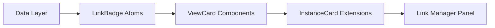

# View Linking &amp; VR Interactions - Implementation Handoff Package

**Version:** 2.0.0  
**Created:** January 2026  
**Purpose:** Complete implementation specifications for View Linking system with full VR support

---

## Table of Contents

1. [Executive Summary](#1-executive-summary)
2. [Architecture Overview](#2-architecture-overview)
3. [File Inventory](#3-file-inventory)
4. [Implementation Order](#4-implementation-order)
5. [Data Layer Specifications](#5-data-layer-specifications)
6. [Desktop Components](#6-desktop-components)
7. [VR Components](#7-vr-components)
8. [Icon System](#8-icon-system)
9. [Integration Points](#9-integration-points)
10. [Testing Strategy](#10-testing-strategy)

---

## 1. Executive Summary

### What This Package Contains

A complete design specification for:
- **View Linking System**: Hub-and-spoke synchronization between ViewConfigurations
- **VR Interaction Patterns**: Platform-adaptive replacements for drag-and-drop
- **Toast Notifications**: User feedback for link operations
- **Floating Panel VR**: 3D panel positioning and management

### Key Design Decisions

| Decision | Rationale |
|----------|-----------|
| **Hub-and-spoke model** | Simpler than peer-to-peer, enables clear ownership |
| **Per-property linking** | Granular control over what syncs |
| **Three link modes** | Follow/Sync/Broadcast cover all collaboration patterns |
| **Tap-to-select in VR** | Replaces drag-drop which doesn't work in VR |
| **Material Symbols icons** | Consistent with existing codebase |

### Total Implementation Scope

- **~8,500 lines** of React component code
- **~600 lines** of data layer specifications
- **~400 lines** of documentation
- **14 design files** ready for implementation

---

## 2. Architecture Overview

### Three-Layer Model

```
┌─────────────────────────────────────────────────────────────┐
│                        DATASET                               │
│  Raw data + annotations (spatially anchored, audit-worthy)  │
└─────────────────────────────────────────────────────────────┘
                              │
                              ▼
┌─────────────────────────────────────────────────────────────┐
│                   VIEW CONFIGURATION                         │
│  How to view the data: camera, filters, colors, widgets     │
│  Server-generated IDs, collaborative state, linkable        │
└─────────────────────────────────────────────────────────────┘
                              │
                              ▼
┌─────────────────────────────────────────────────────────────┐
│                    INSTANCE WINDOW                           │
│  GPU renderer on canvas, client-generated IDs, ephemeral    │
└─────────────────────────────────────────────────────────────┘
```

### Hub-and-Spoke Sync Model

```
         ┌──────────┐
         │  SPOKE   │◄──────┐
         │ (linked) │       │
         └──────────┘       │
              ▲             │
              │             │
         ┌──────────┐       │ Sync Group
         │   HUB    │───────┼──────────►
         │  (★)     │       │
         └──────────┘       │
              │             │
              ▼             │
         ┌──────────┐       │
         │  SPOKE   │◄──────┘
         │ (linked) │
         └──────────┘

- Hub owns authoritative state
- Changes flow: Hub → All Spokes
- Hub role can transfer
- Links are per-property
```

### Linkable Properties

| Property | Icon Name | Description |
|----------|-----------|-------------|
| `camera` | `camera` | Position, rotation, zoom, focal point |
| `filters` | `tune` | Data filters, thresholds, ranges |
| `colorMaps` | `palette` | Color mapping configurations |
| `widgets` | `widgets` | Measurement tools, cutting planes |
| `cursors` | `eye` | Pointer positions, selections |
| `annotationDisplay` | `editNote` | Which annotations are visible |

### Link Modes

| Mode | Icon | Direction | Use Case |
|------|------|-----------|----------|
| `follow` | `arrowLeft` | Hub → Spoke (one-way) | Presenter/student |
| `sync` | `arrowLeftRight` | Bidirectional | Equal collaboration |
| `broadcast` | `arrowRight` | Hub-only changes | Demo mode |

---

## 3. File Inventory

### Design Files (in `/home/claude/`)

| File | Purpose | Lines | Priority |
|------|---------|-------|----------|
| `ViewConfigurationManager_Hub_Model_Spec.js` | Data layer with Y.js integration | ~600 | P0 |
| `link-manager-panels.jsx` | ViewLinkManagerPanel, UserFollowingPanel, WorkspaceLinkHub | ~800 | P0 |
| `view-card-components.jsx` | ViewCard variants for different contexts | ~600 | P0 |
| `instance-card-link-extensions.jsx` | LinkBadge atoms, InstanceCard extensions | ~700 | P0 |
| `drag-to-link-interaction.jsx` | Desktop drag-to-link with DragContext | ~500 | P0 |
| `canvas-link-indicators.jsx` | Visual feedback on canvas | ~900 | P1 |
| `toast-notification-system.jsx` | ToastProvider and pre-built toasts | ~500 | P1 |
| `vr-interaction-patterns.jsx` | Generic VR interaction abstractions | ~800 | P1 |
| `vr-view-linking-implementation.jsx` | VR-specific linking components | ~700 | P1 |
| `vr-canvas-interactions.jsx` | VR transfer, zones, canvas expand | ~800 | P1 |
| `vr-floating-panel-system.jsx` | VR panel positioning and management | ~900 | P2 |
| `vr-canvas-navigator.jsx` | VR minimap interactions | ~850 | P2 |
| `icon-mapping-reference.js` | Emoji to Material Symbol mapping | ~200 | P0 |
| `View_Linking_System_Implementation_Guide_v2.md` | Context document | ~400 | Reference |

### Where Files Should Live in Codebase

```
src/
├── core/
│   └── data/
│       └── managers/
│           └── ViewConfigurationManager.js  ← Hub model methods
│
├── ui/
│   └── react/
│       ├── components/
│       │   ├── atoms/
│       │   │   └── LinkBadge/              ← Badge components
│       │   ├── molecules/
│       │   │   └── ViewCard/               ← ViewCard variants
│       │   ├── organisms/
│       │   │   └── InstanceCard/           ← Extended InstanceCard
│       │   └── panels/
│       │       ├── LinkManagerPanel/       ← View Link Manager
│       │       ├── UserFollowingPanel/     ← User Following
│       │       └── WorkspaceLinkHub/       ← Workspace Links Hub
│       │
│       ├── context/
│       │   ├── DragToLinkContext.jsx       ← Drag state management
│       │   ├── ToastContext.jsx            ← Toast notifications
│       │   ├── VRInteractionContext.jsx    ← VR interaction state
│       │   └── VRPanelContext.jsx          ← VR panel management
│       │
│       └── hooks/
│           ├── useLinkInteraction.js       ← Platform-adaptive linking
│           ├── useVRTransfer.js            ← VR canvas transfers
│           └── useVRNavigator.js           ← VR minimap interactions
```

---

## 4. Implementation Order

### Phase 1: Foundation (P0)



**Steps:**

1. **Add hub model to ViewConfigurationManager**
   - Extend existing manager with link methods
   - Add Y.js sync for `linkState` subdocument
   - File: `ViewConfigurationManager_Hub_Model_Spec.js`

2. **Create LinkBadge atom components**
   - `LinkBadge`, `LinkBadgeStack`, `HubIndicator`, `LinkCountBadge`
   - File: `instance-card-link-extensions.jsx` (Part 1)

3. **Create ViewCard variants**
   - `ViewCard`, `ViewCardCompact`, `ViewCardDetailed`
   - File: `view-card-components.jsx`

4. **Extend InstanceCard with link affordances**
   - Add badge props, hover states, actions
   - File: `instance-card-link-extensions.jsx` (Part 2)

5. **Build View Link Manager panel**
   - Main linking UI for right panel
   - File: `link-manager-panels.jsx` (ViewLinkManagerPanel)

### Phase 2: Desktop Interactions (P0-P1)

6. **Implement drag-to-link**
   - DragToLinkContext provider
   - Source/target handlers
   - File: `drag-to-link-interaction.jsx`

7. **Add canvas visual indicators**
   - Border, ripples, connection lines
   - File: `canvas-link-indicators.jsx`

8. **Implement toast notifications**
   - ToastProvider, link-specific toasts
   - File: `toast-notification-system.jsx`

### Phase 3: Additional Panels (P1)

9. **Build User Following panel**
   - Follow other users' views
   - File: `link-manager-panels.jsx` (UserFollowingPanel)

10. **Build Workspace Links Hub**
    - Overview of all sync groups
    - File: `link-manager-panels.jsx` (WorkspaceLinkHubPanel)

### Phase 4: VR Support (P1-P2)

11. **Implement VR interaction patterns**
    - Generic hooks for all intents
    - File: `vr-interaction-patterns.jsx`

12. **Implement VR view linking**
    - Tap-to-select flow
    - File: `vr-view-linking-implementation.jsx`

13. **Implement VR canvas interactions**
    - Transfer, zones, modifiers
    - File: `vr-canvas-interactions.jsx`

14. **Implement VR panel system**
    - 3D positioning, grab-to-move
    - File: `vr-floating-panel-system.jsx`

15. **Implement VR canvas navigator**
    - Minimap cell repositioning
    - File: `vr-canvas-navigator.jsx`

---

## 5. Data Layer Specifications

### ViewConfigurationManager Extensions

Add these methods to the existing ViewConfigurationManager:

```javascript
// Link Management
createLink(sourceViewId, targetViewId, property, mode)
removeLink(sourceViewId, property)
updateLinkMode(viewId, property, newMode)
transferHub(oldHubId, newHubId, property)

// Link Queries
getLinksForView(viewId) → Map<property, LinkInfo>
getGroupMembers(hubId, property) → ViewConfiguration[]
isHub(viewId, property) → boolean
getHub(viewId, property) → ViewConfiguration | null
canLinkTo(sourceId, targetId, property) → { valid, reason }

// Sync Propagation
propagateChange(hubId, property, newValue)
handleRemoteChange(viewId, property, newValue)
```

### Y.js State Structure

```javascript
yViews.get(viewId) = {
  // Existing fields...
  
  // New link state subdocument
  linkState: Y.Map({
    links: Y.Map({
      camera: { targetId, mode, linkedAt, linkedBy },
      filters: { targetId, mode, linkedAt, linkedBy },
      // ... per property
    }),
    isHub: Y.Map({
      camera: true/false,
      filters: true/false,
      // ... per property
    }),
    hubSince: Y.Map({
      camera: timestamp,
      // ...
    })
  })
}
```

### Link Validation Rules

```javascript
function canLinkTo(sourceId, targetId, property) {
  // Rule 1: Can't link to self
  if (sourceId === targetId) 
    return { valid: false, reason: 'Cannot link to self' };
  
  // Rule 2: Can't create cycles
  if (wouldCreateCycle(sourceId, targetId, property))
    return { valid: false, reason: 'Would create circular link' };
  
  // Rule 3: Spokes can't link to other spokes
  const targetHub = getHub(targetId, property);
  if (targetHub && targetHub.id !== targetId)
    return { valid: false, reason: 'Target is already linked. Link to its hub instead.' };
  
  // Rule 4: Permission check
  if (!canUserLink(currentUserId, targetId))
    return { valid: false, reason: 'Permission denied' };
  
  return { valid: true };
}
```

---

## 6. Desktop Components

### Component Hierarchy

```
ViewLinkManagerPanel
├── ViewSelector (dropdown)
├── ActiveLinksSection
│   └── PropertyLinkRow (×6)
│       ├── PropertyIcon
│       ├── PropertyLabel
│       ├── LinkedViewCard (if linked)
│       │   ├── ViewColorDot
│       │   ├── ViewName
│       │   ├── ModeSwitcher
│       │   └── UnlinkButton
│       └── LinkTargetDropdown (if not linked)
├── SuggestedLinksSection
│   └── SuggestedLinkCard[]
└── ActionsFooter
    ├── LinkAllButton
    └── UnlinkAllButton
```

### Key Props Interfaces

```typescript
interface ViewCardProps {
  view: ViewConfiguration;
  variant: 'compact' | 'detailed' | 'minimal';
  isSelected?: boolean;
  isHub?: boolean;
  linkedProperties?: string[];
  linkCount?: number;
  showActions?: boolean;
  onSelect?: (viewId: string) => void;
  onLinkClick?: (viewId: string, property: string) => void;
}

interface LinkBadgeProps {
  property: string;
  mode: 'follow' | 'sync' | 'broadcast';
  isHub?: boolean;
  targetView?: { id: string; name: string; color: string };
  onModeChange?: (mode: string) => void;
  onUnlink?: () => void;
}

interface DragToLinkContextValue {
  isDragging: boolean;
  dragSource: { viewId: string; property: string } | null;
  validTargets: string[];
  startDrag: (viewId: string, property: string) => void;
  endDrag: () => void;
  handleDrop: (targetViewId: string) => void;
}
```

---

## 7. VR Components

### VR Interaction Flow Summary

| Desktop Action | VR Equivalent | Component |
|----------------|---------------|-----------|
| Drag badge → Drop | Tap source → Tap target → Confirm panel | `VRLinkBadge`, `VRQuickLinkPanel` |
| Drag in list | Tap item → Up/Down buttons | `VRReorderControls` |
| Drag panel | Grip + move controller | `VRFloatingPanel` |
| Resize panel edge | Thumbstick while grabbed | `VRFloatingPanel` |
| Drag to canvas | Tap source → Tap cell → Zone picker | `VRTransferableSource`, `VRZonePicker` |
| Mouse position zones | Explicit zone selection | `VRZonePicker` |
| Shift/Ctrl/Alt | Toggle switches | `ModifierToggle` |
| Drag cell in minimap | Tap cell → Tap destination | `VRMinimapCell` |
| Right-click context | Long-press → Radial menu | `VRCellContextMenu` |

### VR Panel Positioning Modes

| Mode | Behavior | Icon |
|------|----------|------|
| HUD | Follows head rotation | `eye` |
| WORLD | Fixed in 3D space | `globe` |
| HAND | Near controller | `pan` |
| DASHBOARD | Curved arc arrangement | `dashboard` |

### VR Controller Mapping

```
RIGHT CONTROLLER:
├── Trigger    → select / confirm
├── Grip       → grab panel / multi-select modifier
├── A Button   → confirm action
├── B Button   → cancel / back
├── Thumbstick → navigate / resize (when grabbed)
└── Stick Press → context menu

LEFT CONTROLLER:
├── Trigger    → secondary select
├── Grip       → secondary grab
├── X Button   → toggle menu
├── Y Button   → home / recenter
├── Thumbstick → locomotion
└── Stick Press → recenter view
```

---

## 8. Icon System

### Usage Pattern

```jsx
// Import
import { Icon } from '@UI/react/components/atoms/Icon';

// Basic usage
<Icon name="link" size={16} />

// With color
<Icon name="link" size={16} color="#2dd4bf" />

// Clickable
<Icon name="settings" size={20} onClick={handleClick} />
```

### Icon Reference for This Feature

| Purpose | Icon Name | Fallback |
|---------|-----------|----------|
| Link/Connection | `link` | |
| Unlink | `linkOff` | |
| Hub indicator | `star` | |
| Camera property | `camera` | |
| Filters property | `tune` | `sliders` |
| Color maps | `palette` | |
| Widgets | `widgets` | `straighten` |
| Cursors | `eye` | |
| Annotations | `editNote` | |
| Follow mode | `arrowLeft` | |
| Sync mode | `arrowLeftRight` | `swapHoriz` |
| Broadcast mode | `arrowRight` | |
| Users/Group | `users` | |
| Single user | `user` | |
| Home | `home` | |
| Target/Navigate | `target` | |
| Settings | `settings` | |
| Close/Cancel | `close` | |
| Check/Confirm | `check` | |
| Add | `add` | |
| Delete | `delete` | |
| Copy | `copy` | |
| Move | `arrowLeftRight` | |
| Info toast | `info` | |
| Success toast | `checkCircle` | |
| Warning toast | `warning` | |
| Error toast | `error` | |
| Sync toast | `sync` | |
| VR HUD mode | `eye` | |
| VR World mode | `globe` | |
| VR Hand mode | `pan` | |
| VR Dashboard | `dashboard` | |
| Direction up | `arrowUp` | |
| Direction down | `arrowDown` | |
| Direction left | `arrowLeft` | |
| Direction right | `arrowRight` | |
| Zoom in | `zoomIn` | |
| Zoom out | `zoomOut` | |

### Converting Design Files

All design files use emoji placeholders. Convert as follows:

```jsx
// BEFORE (in design files)
<span style={{ fontSize: '20px' }}>🔗</span>

// AFTER (in implementation)
<Icon name="link" size={20} />
```

See `icon-mapping-reference.js` for complete emoji → icon name mapping.

---

## 9. Integration Points

### Existing Manager Integration

```javascript
// ViewConfigurationManager.js
import { LinkMixin } from './mixins/LinkMixin';

class ViewConfigurationManager {
  // ... existing code ...
}

// Apply mixin
Object.assign(ViewConfigurationManager.prototype, LinkMixin);
```

### Y.js Document Structure

```javascript
// In yViews document, add linkState to each view
const viewDoc = new Y.Map();
viewDoc.set('linkState', new Y.Map());
viewDoc.get('linkState').set('links', new Y.Map());
viewDoc.get('linkState').set('isHub', new Y.Map());
```

### Event Bus Integration

```javascript
// Emit when links change
eventBus.emit('view:linked', { sourceId, targetId, property, mode });
eventBus.emit('view:unlinked', { viewId, property });
eventBus.emit('view:hubTransferred', { property, oldHubId, newHubId });
eventBus.emit('view:propertyChanged', { hubId, property, value });
```

### Right Panel Integration

```javascript
// Add to panel registry
const PANEL_COMPONENTS = {
  // ... existing panels ...
  'view-links': ViewLinkManagerPanel,
  'user-following': UserFollowingPanel,
  'workspace-links': WorkspaceLinkHubPanel,
};
```

### Toast Integration

```javascript
// In App.jsx or root component
import { ToastProvider } from './context/ToastContext';

function App() {
  return (
    <ToastProvider position="bottom-right">
      {/* ... app content ... */}
    </ToastProvider>
  );
}
```

### VR Mode Detection

```javascript
// In components that need VR adaptation
import { useAdaptive } from '@UI/react/hooks/useAdaptive';

function LinkBadge(props) {
  const { isVR } = useAdaptive();
  
  if (isVR) {
    return <VRLinkBadge {...props} />;
  }
  
  return <DesktopLinkBadge {...props} />;
}
```

---

## 10. Testing Strategy

### Unit Tests

```javascript
// ViewConfigurationManager link methods
describe('ViewConfigurationManager Links', () => {
  test('createLink establishes hub-spoke relationship', () => {});
  test('removeLink cleans up both sides', () => {});
  test('transferHub updates all spoke references', () => {});
  test('canLinkTo prevents cycles', () => {});
  test('canLinkTo prevents spoke-to-spoke links', () => {});
});
```

### Component Tests

```javascript
// LinkBadge rendering
describe('LinkBadge', () => {
  test('shows hub star when isHub', () => {});
  test('shows correct mode icon', () => {});
  test('triggers onModeChange on click', () => {});
});

// ViewCard interactions
describe('ViewCard', () => {
  test('highlights on drag over when valid target', () => {});
  test('shows link affordances on hover', () => {});
});
```

### Integration Tests

```javascript
// Drag-to-link flow
describe('Drag to Link', () => {
  test('complete flow: drag badge → drop on card → link created', () => {});
  test('shows toast on successful link', () => {});
  test('cancels on escape key', () => {});
});

// VR tap-to-select flow
describe('VR Linking', () => {
  test('tap source → tap target → panel → confirm', () => {});
  test('B button cancels at any step', () => {});
});
```

### E2E Tests

```javascript
// Multi-user sync
describe('Link Synchronization', () => {
  test('camera changes propagate to all linked views', () => {});
  test('hub transfer syncs to all participants', () => {});
});
```

---

## Appendix A: Quick Reference

### Shorthand for Common Operations

```javascript
// Create camera link
linkManager.createLink(sourceId, targetId, 'camera', 'sync');

// Get all camera-linked views
const cameraGroup = linkManager.getGroupMembers(hubId, 'camera');

// Check if view is hub for any property
const isAnyHub = LINKABLE_PROPERTIES.some(p => linkManager.isHub(viewId, p));

// Link all properties at once
LINKABLE_PROPERTIES.forEach(prop => {
  linkManager.createLink(sourceId, targetId, prop, 'sync');
});
```

### CSS Custom Properties for Theming

```scss
// Link colors
--link-color-follow: #60a5fa;    // Blue
--link-color-sync: #2dd4bf;      // Teal
--link-color-broadcast: #fbbf24; // Amber
--link-color-hub: #f472b6;       // Pink

// Property colors
--prop-camera: #2dd4bf;
--prop-filters: #a78bfa;
--prop-colorMaps: #f472b6;
--prop-widgets: #fbbf24;
--prop-cursors: #60a5fa;
--prop-annotations: #fb923c;
```

---

## Appendix B: Glossary

| Term | Definition |
|------|------------|
| **Hub** | The authoritative source in a sync group |
| **Spoke** | A view linked to a hub |
| **Sync Group** | Hub + all its spokes for a specific property |
| **Property** | One of 6 linkable aspects of a view |
| **Mode** | How changes flow: follow/sync/broadcast |
| **Transfer** | Moving hub role to another view |

---

## Contact

For questions about this specification, refer to the design session transcripts in the Claude Project or search past conversations for "View Linking" context.
